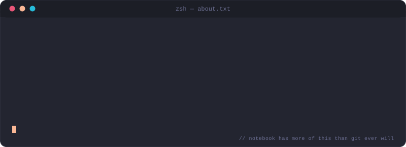

<picture>
  <source media="(prefers-color-scheme: dark)" srcset="https://capsule-render.vercel.app/api?type=waving&color=0:E95678%2C50:FAB795%2C100:26BBD9&height=200&section=header&text=npx%20create-Karri%20--vibe%3Dchaotic-good&fontSize=30&fontColor=F2F2F2&animation=fadeIn&fontAlignY=38&desc=frontend%20engineer%20%C2%B7%20motion%20%C2%B7%20interfaces&descAlignY=58&descSize=16&descColor=F2F2F2" />
  <source media="(prefers-color-scheme: light)" srcset="https://capsule-render.vercel.app/api?type=waving&color=0:E95678%2C50:FAB795%2C100:26BBD9&height=200&section=header&text=npx%20create-Karri%20--vibe%3Dchaotic-good&fontSize=30&fontColor=1C1E26&animation=fadeIn&fontAlignY=38&desc=frontend%20engineer%20%C2%B7%20motion%20%C2%B7%20interfaces&descAlignY=58&descSize=16&descColor=1C1E26" />
  
</picture>

<picture>
  <source media="(prefers-color-scheme: dark)" srcset="https://readme-typing-svg.demolab.com?font=Fira+Code&size=16&duration=2600&pause=800&color=F2F2F2&center=true&vCenter=true&width=620&lines=%3E+builds+interfaces+that+move+like+they+mean+it_;%3E+GSAP+for+timing%2C+Three.js+for+depth%2C+particles+for+flair_;%3E+frontend+first%2C+backend+when+the+UI+needs+it_" />
  <source media="(prefers-color-scheme: light)" srcset="https://readme-typing-svg.demolab.com?font=Fira+Code&size=16&duration=2600&pause=800&color=1C1E26&center=true&vCenter=true&width=620&lines=%3E+builds+interfaces+that+move+like+they+mean+it_;%3E+GSAP+for+timing%2C+Three.js+for+depth%2C+particles+for+flair_;%3E+frontend+first%2C+backend+when+the+UI+needs+it_" />
  
</picture>

### Core Stack

  

### Motion &amp; Graphics

  
  

plus tsParticles for lightweight background effects

### Also touch, when the interface needs it

  

 

 

### Terminal session

  

 

### Now Playing

  

<b>Setup — click to expand</b>

 

Want your own live "now playing" card?

1. Go to [kittinan/spotify-github-profile](https://github.com/kittinan/spotify-github-profile) and follow the steps in their README — it walks you through authorizing your own Spotify account. No deployment or hosting required.
2. It'll hand you a personal API URL shaped like `https://spotify-github-profile.kittinanx.com/api/view?uid=YOUR-UID&cover_image=true&theme=default`.
3. Swap the `src` in the `` above for your own URL — it'll then update automatically based on your own listening activity.

 

### Play

  

<b>Setup — click to expand</b>

 

A tiny canvas game (dodge the bug, press space/click/tap to jump) — `game.html` is included alongside this README. To host your own copy:

1. In your own `yourusername/yourusername` repo, create a `docs/` folder and save `game.html` there as `docs/index.html`.
2. Go to **Settings → Pages**, set source to **Deploy from a branch**, branch `main`, folder `/docs`.
3. After a minute or two, it'll be live at `https://yourusername.github.io/yourusername/` point the badge above at that URL once it's up.

 

### Connect

  
  <!-- swap the # for your real links -->
  

 

  

